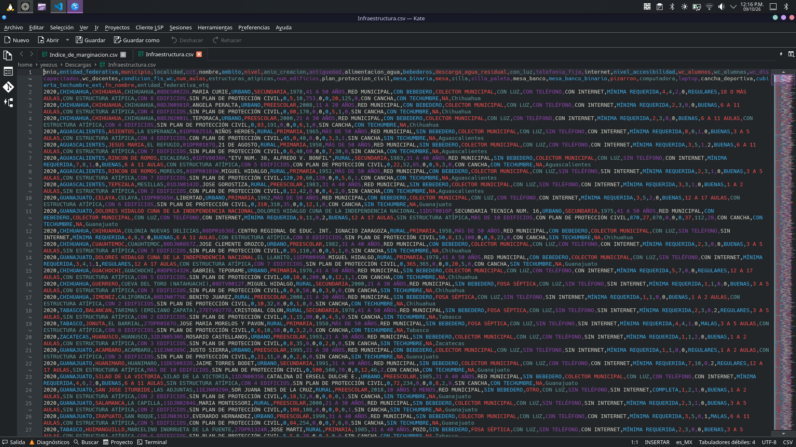
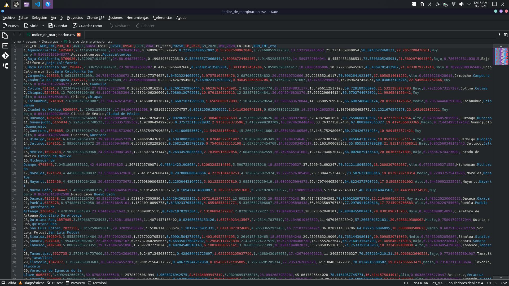
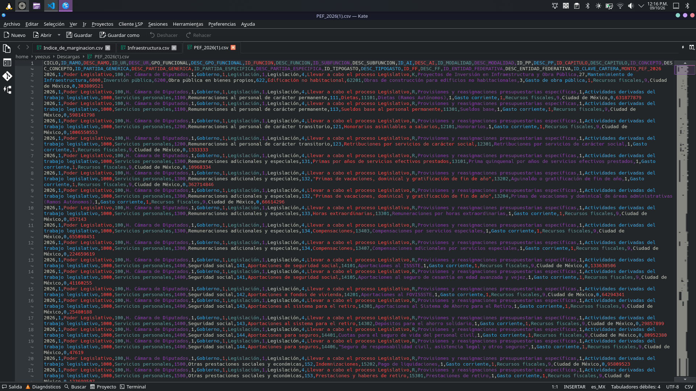
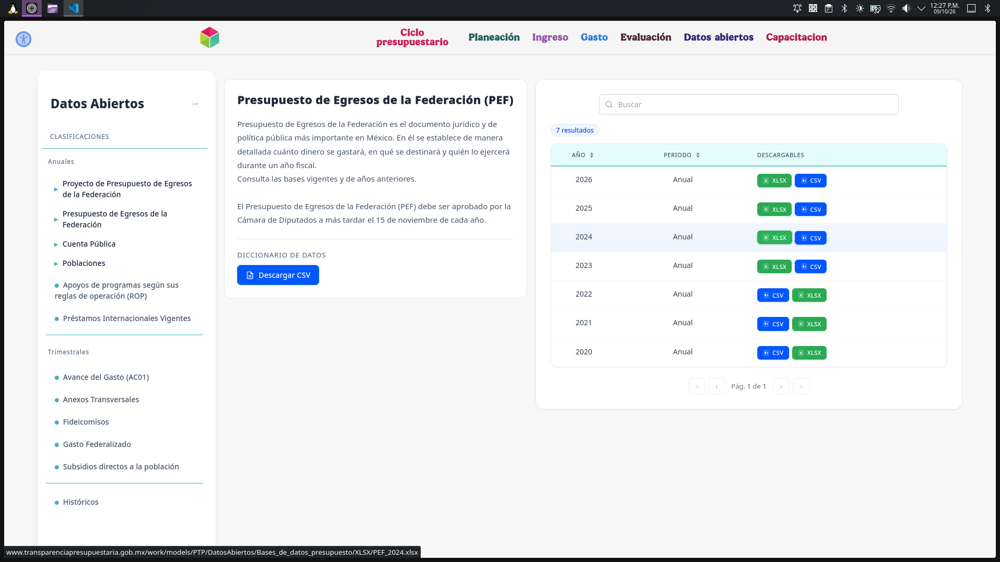

::: {.column-page-left}

## 1. Proceso de Búsqueda y Evaluación de Fuentes

Se llevó a cabo una búsqueda directa en portales de datos abiertos gubernamentales (`datos.gob.mx`, `transparenciapresupuestaria.gob.mx`) y herramientas de *deep research* . El objetivo fue localizar bases de datos que permitieran evaluar la viabilidad técnica, el contexto socioeconómico y el apalancamiento financiero para el despliegue del proyecto. 

Se evaluaron 5 fuentes candidatas, documentando los criterios de selección para elegir las 3 definitivas:

1. **Información Infraestructura Física Educativa (SEP):** Archivo CSV en `datos.gob.mx`. Seleccionada por contener variables explícitas a nivel de Centro de Trabajo (CCT) como `con_luz`, `computadora`, `laptop` e `internet`.
2. **Índices de Marginación (CONAPO):** Base tabular en `datos.gob.mx`. Seleccionada para integrar la priorización por vulnerabilidad social a nivel geográfico.
3.  **Presupuesto de Egresos de la Federación (SHCP):** Datos abiertos en el portal de Transparencia Presupuestaria. Seleccionada para contrastar presupuestos estatales contra el ahorro estimado en licencias comerciales.
4. **Censo de Escuelas, Maestros y Alumnos de Educación Básica y Especial (CEMABE - INEGI):** Evaluada como candidata, pero descartada debido a que los datos de infraestructura física de la SEP ofrecen una actualización más dinámica y un cruce más directo con el estatus eléctrico actual de las escuelas.
5. **Formato 911 (SEP):** Evaluada, pero descartada para evitar redundancia de datos, no entregaba nada nuevo de información, ni contenía datos "interesantes".

## 2. Fuentes Elegidas

A continuación, se catalogan las tres fuentes definitivas verificadas.

| Campo | Fuente 1: Infraestructura Física | Fuente 2: Índices de Marginación | Fuente 3: Presupuesto PEF |
| :--- | :--- | :--- | :--- |
| **Nombre y dueño** | Información de Infraestructura Física Educativa (Secretaría de Educación Pública)  | Índices de Marginación (Consejo Nacional de Población - CONAPO) | Presupuesto de Egresos de la Federación (Secretaría de Hacienda y Crédito Público) |
| **URL y acceso** | https://www.datos.gob.mx/dataset/informacion_infraestructura_fisica_educativa/resource/7e810e5d-de87-4587-99e4-3088a137e627 (Descarga directa) | https://www.datos.gob.mx/dataset/indices_marginacion/resource/d217f9aa-70e5-4176-b00b-3a92b7541a1e (Descarga directa) | https://www.transparenciapresupuestaria.gob.mx/Datos-Abiertos#/PEF (Descarga directa) |
| **Formato y tamaño** | CSV 953 kb. | CSV / Excel, 8 kb | CSV, >500 MB anual  |
| **Grano** | Un registro por escuela/Centro de Trabajo (CCT) | Un registro por entidad/municipio | Un registro por partida de gasto/programa presupuestario  |
| **Cobertura** | Nacional  | Nacional  | Nacional  |
| **Licencia y restricciones** | Datos Abiertos Gubernamentales (Libre uso) | Libre uso, citando fuente oficial  | Datos Abiertos Gubernamentales  |
| **Llaves de integración** | `clave_cct`, `entidad_federativa`  | `NOM_ENT`  | `DESC_ENTIDAD_FEDERATIVA`  |
| **Pregunta(s) de E0** | P1   | P2   | P4   |

## Verificación Por Fuente

1. **Información Infraestructura Física Educativa (SEP):** 

2. **Índices de Marginación (CONAPO):**

3. **Presupuesto de Egresos de la Federación (SHCP):** 

##  Análisis de Integración

Para su integración se tomaran en cuenta las siguientes consideraciones:

* **Llaves de Unión :** Se utilizará la entidad federativa. Vamos usar `Infraestructura.csv` (primera fuente) como "base". Para vincular los datos de CONAPO, se unira el campo `entidad_federativa` de la SEP con el campo `NOM_ENT` del Índice de Marginación. Y para los datos del PEF se unirá `entidad_federativa` de la SEP con `DESC_ENTIDAD_FEDERATIVA` del PEF 
* **Diferencias de Granularidad:** La fuente de la SEP tiene un grano muy fino (fila por escuela) mientras que las otras dos fuentes van por entidad y municipio
* **Problemas Anticipados:** Al revisar las fuentes notamos que puede existen variaciones en el campo de la entidad federativa (`entidad_federativa`, `NOM_ENT`, `DESC_ENTIDAD_FEDERATIVA`), por lo que podemos prever que existan errores por diferencias ortográficas (acentos, uso de mayúsculas, abreviaturas, etc). Se necesitara limpiar y estandarizar los datos.