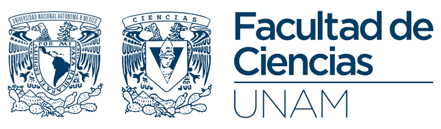

::: {.column-page-left}

{fig-align="center" width="70%"}

# Bienvenida

Bienvenido al repositorio y sitio web del Proyecto Integrador para la asignatura de Almacenes y Minería de Datos de la Facultad de Ciencias, UNAM. 

En este sitio se documenta el desarrollo incremental del proyecto bajo la metodología CRISP-DM.

---

### Resumen del proyecto

Este proyecto aborda la problemática inminente de obsolescencia en los laboratorios de cómputo de las escuelas públicas del país, provocada por el fin del soporte oficial de Windows 10 y la incompatibilidad de las computadoras existentes con los requisitos de hardware de Windows 11. Ante la falta de presupuesto para renovar el parque informático, la propuesta consiste en implementar un programa de rescate tecnológico orientado al reacondicionamiento de equipos mediante la instalación de distribuciones ligeras de Linux. Para llevar a cabo esta estrategia de manera eficiente, el proyecto utiliza modelos de minería de datos (clasificación supervisada y ranking prioritario) que analizan variables socio-demográficas, de infraestructura y de conectividad provenientes de bases de datos públicas (SEP e INEGI). Esto permitirá al Coordinador de Tecnologías de la SEP identificar y priorizar los planteles educativos con mayor urgencia y factibilidad técnica de migración.

---

### Recursos y archivos del proyecto

A través de la barra de navegación superior se puede acceder a las distintas secciones tales como:

**E0: Comprensión del Negocio**:

* **[Bitácora de Entrevista]:** Diagnóstico y registro del diálogo con el Coordinador de TIC de la SEP.
* **[Business Understanding Canvas]:** Matriz sintética con el problema, objetivos, restricciones y actores del proyecto.
* **[Preguntas de Investigación]:** Preguntas de negocio traducidas a tareas cuantitativas y variables de minería.
* **[Criterio de Éxito]:** Métricas clave de rendimiento operativo y técnico ($F1\text{-}score$, precisión y ahorro presupuestal).
* **[Supuestos y Riesgos]:** Amenazas asociadas al proyecto, compatibilidad de hardware y planes de mitigación.
* **[Uso de IA]:** Registro transparente del apoyo de modelos de lenguaje en el diseño del entregable.

:::